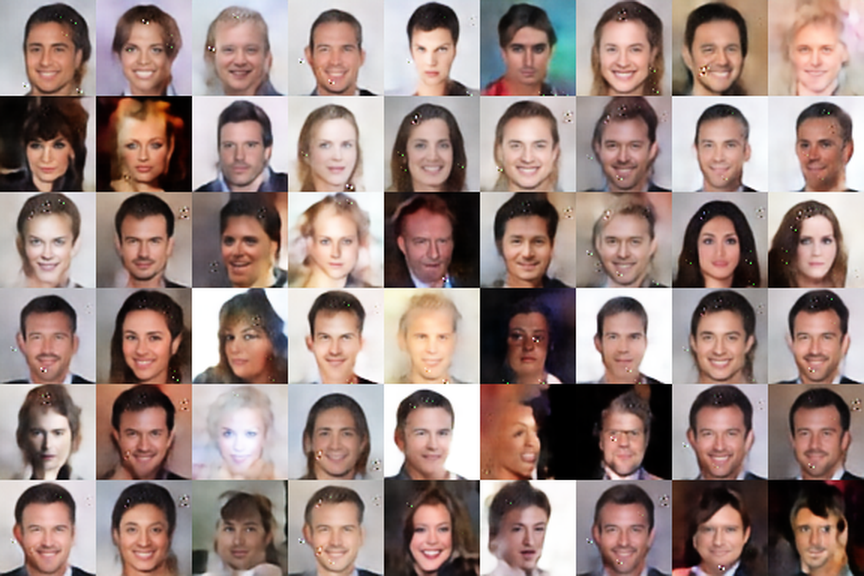
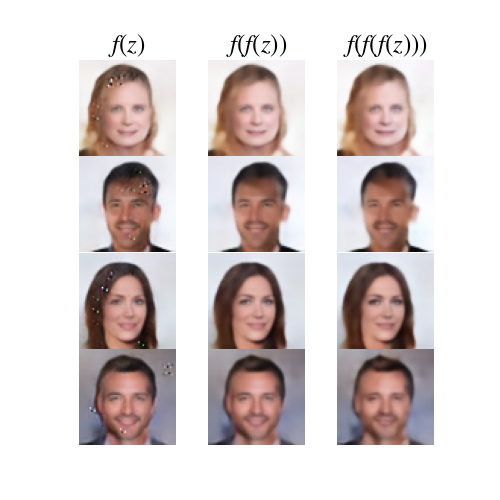

# Idempotent Generative Network
A reproduction of [Idempotent Generative Network](https://arxiv.org/abs/2311.01462) trained on CelebA dataset
# Generated images
sample images generated by the model I trained for 200 epochs

# Idempotence of the model
exmaples to show the idempotence of the model

